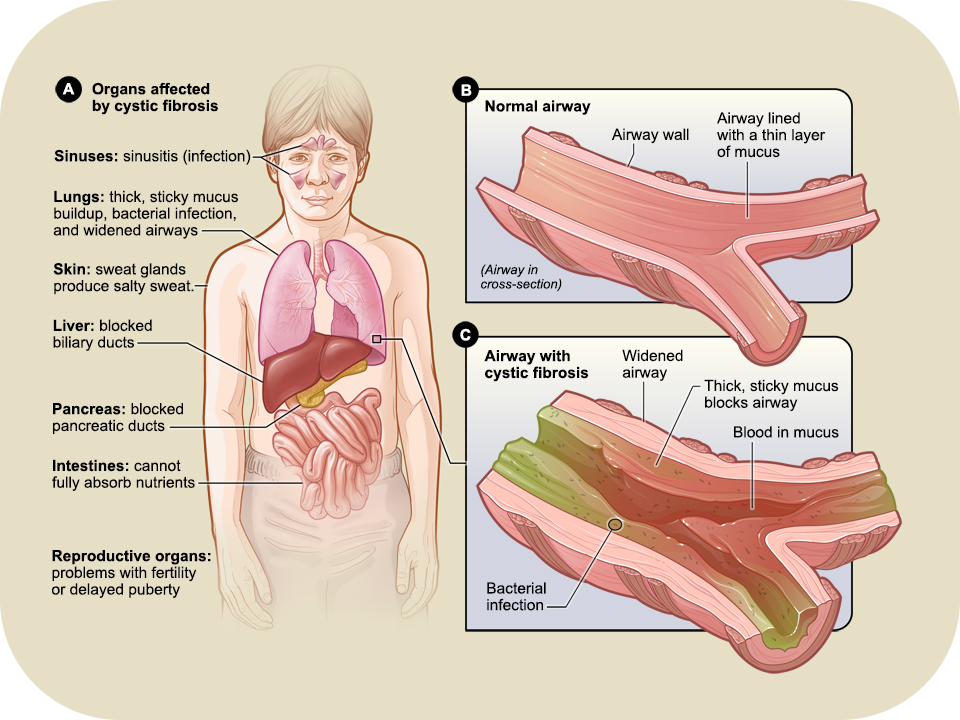

# Cystic Fibrosis

**Cystic Fibrosis (CF)** is a rare genetic disorder that affects approximately 70,000 people worldwide, causing a variety of respiratory and digestive problems. In the past, most CF patients didn’t live past childhood, but modern medical care and biotechnological advancements have increased the predicted survival age to 47 years of age. 

