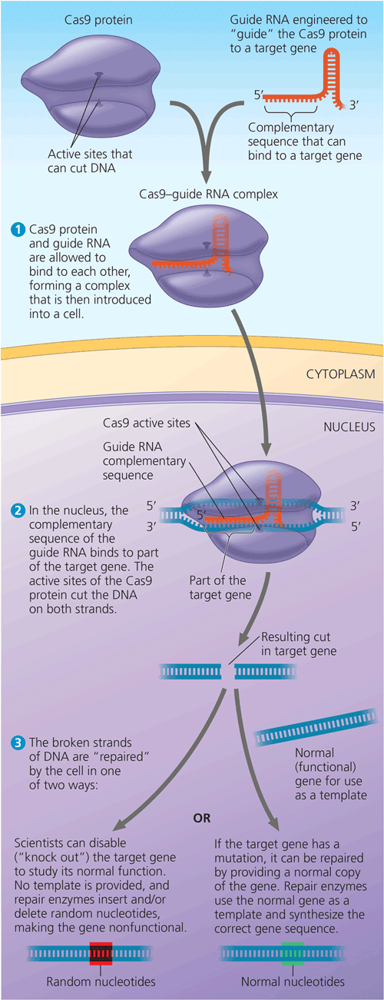
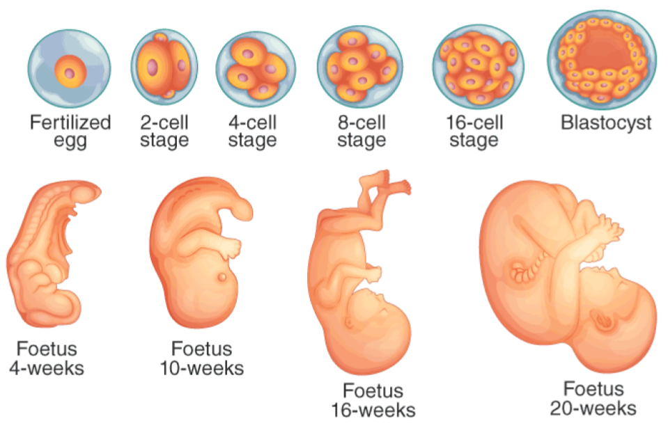
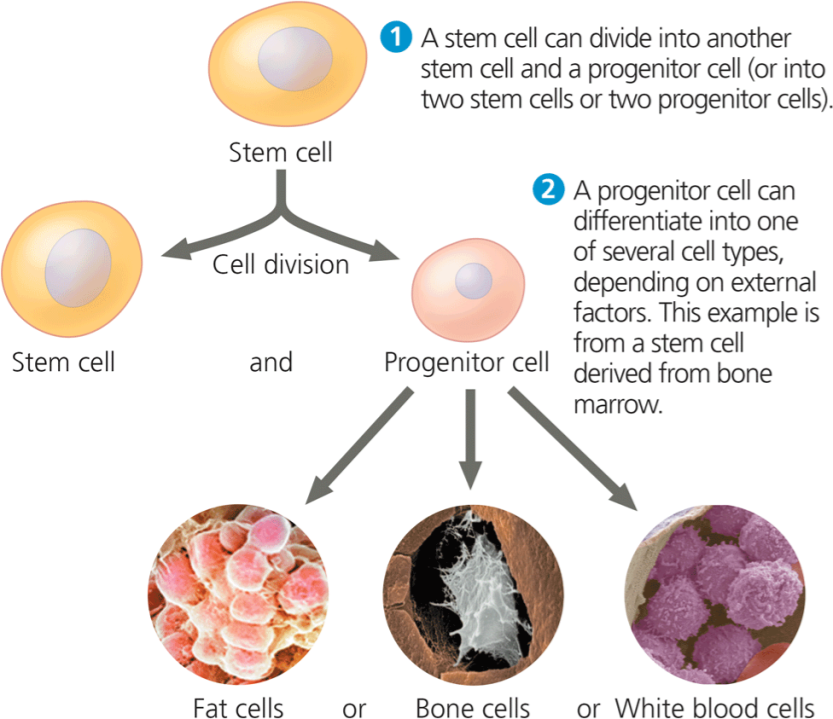

# Biotechnology

The emerging field of biotechnology offers new opportunities to treat and potentially cure CF.

## CRISPR-Cas9

**Gene editing** through the CRISPR (clustered regularly interspaced short palindromic repeats) has the opportunity to revolutionize CF treatment, but, as of yet, it is not feasible in live patients. Since CF is caused by a mutation in the CFTR gene, if researchers could simply replace the mutated CFTR gene in a CF-afflicted cell with a functional CFTR gene, that single cell would essentially be cured. 

The **CRISPR-Cas9** system allows researchers to do exactly that. First, researchers engineer a _guide RNA_ complementary to a conserved (unaffected by mutations across most individuals) region of the CFTR gene and a functional CFTR gene that will replace the mutated one. The researchers then put the guide RNA in _Cas9_, a special enzyme which can then carry it into the nucleus of a single CF-afflicted cell. The guide RNA will bind to the CFTR gene and Cas9 will cut it. Next, the engineered functional CFTR gene will repair the break in the cell’s CFTR gene. With this, the researchers disabled the mutated CFTR gene and replaced it with a functional one, thus curing CF on the cell scale. 

While it is relatively simple for researchers to use CRISPR to cure CF on the cell scale, applying this technique to live humans would be much more difficult. It would be quite ineffective for doctors to open up a CF patien’s lungs and perform CRISPR on each and every cell to cure them of CF. Instead, there are 2 main theoretical ways CRISPR could be used to cure CF on a patient scale:

1. In the early stages of an _embryo_ (developing baby in the womb) that is known to have CF, researchers could perform CRISPR on each of its few cells to replace the mutated CFTR gene with functional ones. As the embryo continues to grow through mitosis (cellular division of somatic cells to produce identical daughter cells), the corrected CFTR gene would be passed on to every cell in the developing body. Thus, upon birth, all of the baby’s cells would have functional CFTR genes thanks to gene editing of the first few embryonic cells. 

{:start="2"}
2. Researchers can gather lung **stem cells** (undifferentiated cells that produce various other differentiated cells) from a CF patient that needs a lung transplant. They can then perform CRISPR on the stem cells to replace the mutated CFTR gene with functional ones. The stem cells, now cured of CF, can now grow into a full lung that is not afflicted with CF. The researchers can then transplant the CF-free lung into the original patient, with less risk of transplant rejection since it came from the patient's own stem cells. 

