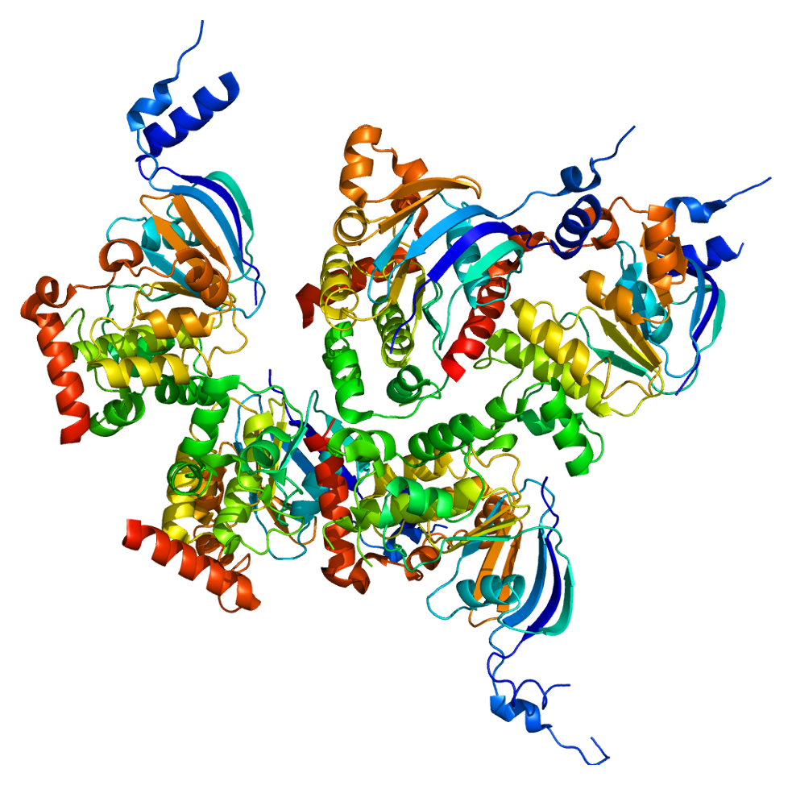
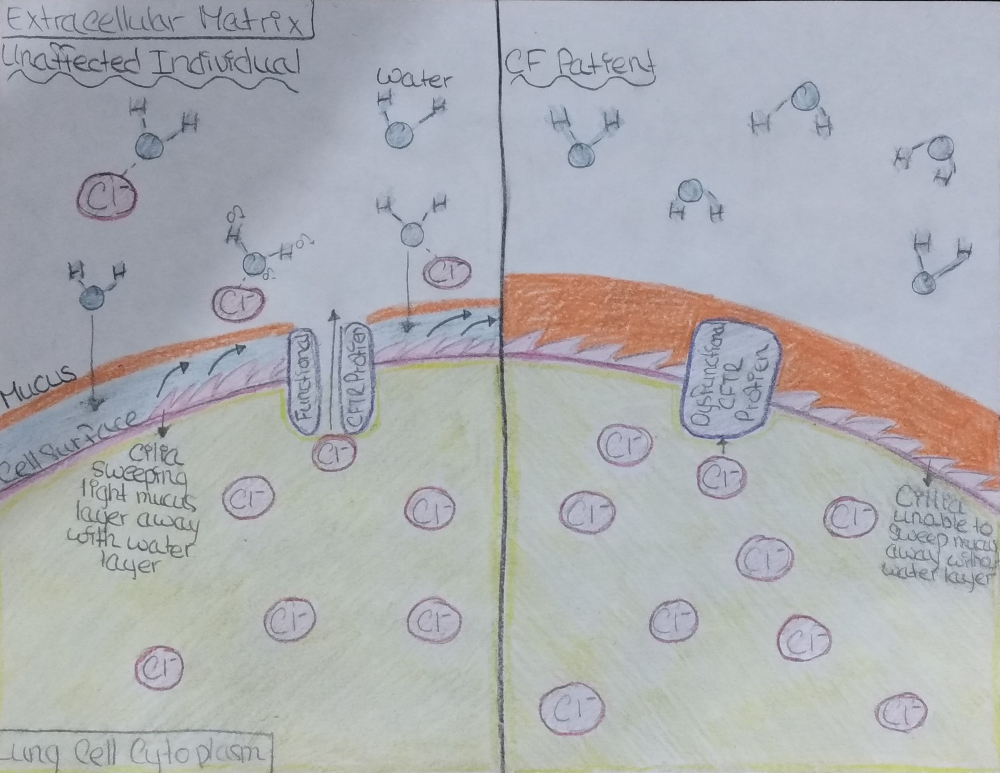

# Cellular Basis

CF patients have a genetic mutation somewhere in the **cystic fibrosis transmembrane conductance regulator (CFTR)** gene (located on chromosome 7) so that their cells either produce dysfunctional or not enough CFTR protein. 

_The CFTR protein is made of 1,480 amino acids._

The normal purpose of the CFTR protein is to act as an ion channel that moves Cl⁻ from the _cytoplasm_ (inside) of cells to the _extracellular matrix_ (outside). CFTR protein is needed to move Cl⁻ to the matrix because the negative charge on Cl⁻ attracts water molecules (H₂O, which has a negatively charged oxygen), thus hydrating the cell surface. In the lungs, this layer of water on the outside of the cell surface allows _cilia_ (broom-like hairs on the surface of lung cells) to sweep excess mucus out of airways. 

When the CFTR protein is dysfunctional, Cl⁻ in the cytoplasm is unable to move to the matrix. With less Cl⁻ in the matrix, water is not attracted to the cell surface. In the lungs, without a layer of water on the cell surface, the mucus is so thick and sticky that cilia can’t sweep the mucus away, so the airways become clogged. 

