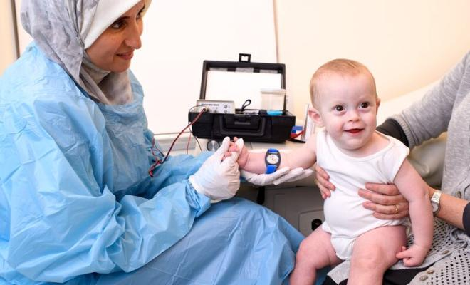

# Diagnosis

## Population Frequency

With only approximately 1,000 new cases of CF diagnosed annually, it is quite a rare genetic disorder. CF affects every racial and ethnic group, although it is more common in white Americans. 
*   Approximately 30,000 Americans have CF (1 in 10,000)
*   Approximately 70,000 people worldwide have CF (1 in 100,000)

_Even though the United States has disproportionately more CF cases than anywhere else in the world, only 1 in 10,000 Americans have CF, making it quite a rare genetic disorder._

## Carrier Testing

To help a couple understand their chances of having a child with CF, the parents can send a sample of blood, saliva, or cheek tissue to a lab where its DNA can be extracted. The lab will then sequence the CFTR gene from the parents’ DNA and check its code against a database of known CF-causing mutations so see whether the parent is a carrier of CF, and may thus pass on the CF-causing allele to their child. Since the lab only checks the parents’ DNA against common CF-causing mutations, if the parent has a rare CF-causing mutation, they may receive a _false negative_ result (the test predicts that they are not a carrier when they truly are). 

## Newborn Screening

Approximately 75% of patients are diagnosed with CF by the time they are 2 years old thanks to newborn screening (NBS), a national program that checks if babies have certain health conditions, including CF. Early diagnosis of CF can help parents keep their babies healthy to prevent or delay the onset of symptoms. 

Within the first few days of the baby’s life, a few blood drops from a heel prick are put on a _Guthrie card_, which is sent to be tested for various health conditions, including CF. Different states have different methods to check for CF from the Guthrie card:
- All states check the level of _immunoreactive trypsinogen (IRT)_ in the blood. Healthy babies have low levels of IRT, whereas babies that experienced a premature/stressful delivery or have CF have high levels of IRT. Thus, if they find high IRT levels in a blood sample, it is an indication that the baby may have CF, but a sweat test is required to complete the diagnosis.
  - If a baby has low IRT levels and its sweat test returned negative, they are unaffected
  - If a baby has high IRT levels and its sweat test returned negative, they are a carrier
  - If a baby has high IRT levels and its sweat test returned positive, they have CF
- Some states also sequence certain regions of the DNA from the baby’s blood sample and check it against a database of mutations that cause genetic disorders.

## Sweat Test

The most reliable way to diagnose CF is to perform a sweat test, a painless one hour exam that measures the amount of Cl⁻ in the sweat. First, _pilocarpine_, a colorless, odorless chemical, and electrical stimulation is applied to the arm or leg to stimulate sweat glands to produce. The sweat is then collected and tested for its Cl⁻ concentration. The very same day, a diagnosis is issued:
-   If an individual has less than 29 millimoles Cl⁻ per liter of sweat, they most likely do not have CF
-   If an individual has between 30 and 59 mmol/L, they may have CF, but an additional sweat test is needed to confirm the diagnosis
-   If an individual has over 60 mmol/L, they most likely have CF

_The baby happily sits for the quick and painless sweat test._
