# Genetic Basis

CF is an **autosomal recessive** disorder.
*   The fact that it is _autosomal_ means that the CFTR gene is carried on somatic, non-sex chromosomes, so the disorder is equally common amongst men and women
*   The fact that it is _recessive_ means that an individual must inherit the recessive allele from both parents to have the disorder

The **dominant allele** (denoted by an uppercase C) carries a gene that produces functional CFTR, wheras the **recessive allele** (denoted by a lowercase c) carries a gene that produces dysfunctional CFTR. There are approximately 1,700 known mutations of the CFTR gene that produce a dysfunctional protein, thus causing CF.
- If an individual inherits 2 recessive alleles, they are a CF patient
- If an individual inherits 1 recessive allele, they are a **carrier**
  - _Carriers_ do not express symptoms of CF, but they may pass the recessive allele onto their children
  - Approximately 10,000,000 Americans are CF carriers (1 in 30)
- If an individual inherits 0 recessive alleles, they are unaffected by CF

The following Punnett Squares express the probability of a set of parents having certain children:

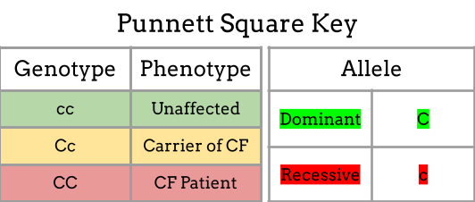

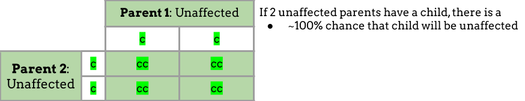

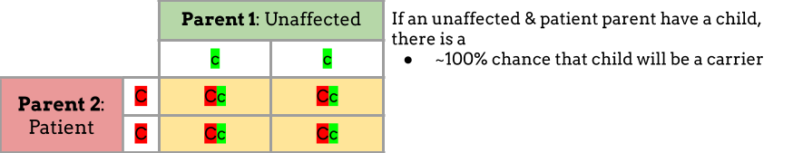

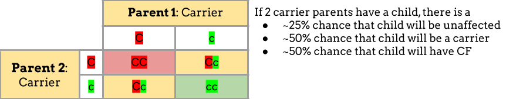

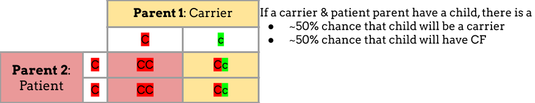

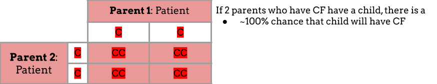

* * *
There are 5 categories of CF-causing mutations:

1. **Protein Production** result in dysfunctional protein being made and are further grouped into 2 categories:

*    **Nonsense mutations** occur when, somewhere in the protein-coding region of the gene that codes for the CFTR protein, certain base pairs were changed to code for a stop signal too early. Thus, the gene is transcribed and processed, but when the ribosome goes to translate its mRNA into a protein, it stops too early, so the full CFTR protein isn’t produced. The partially produced protein is completely dysfunctional, so patients with this type of mutation have no functional CFTR protein, thus more severe symptoms.

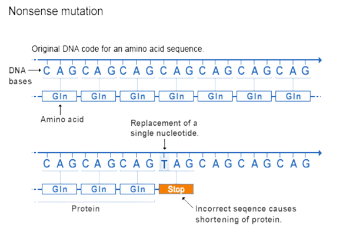

*    **Splice mutations** occur when the protein-coding region of the CFTR gene has no mutations, but the regulatory portion of the gene has a mutation that causes the mRNA to be processed incorrectly. The CFTR gene is transcribed into pre-mRNA normally, but when the cell goes to process it by removing unneeded _introns_ (non-coding portion of gene) so that only the necessary _exons_ (coding portion of gene) remain, the cell doesn’t know where to splice because the regulatory gene was mutated. Thus, the processed mRNA is left with some bases from the introns and lacks some from the exons. This incorrect mRNA is translated, but it produces a dysfunctional protein. Depending on how many mistakes the cell made in splicing the mRNA, the CFTR protein produced may be more or less functional, so the severity of symptoms associated with this mutation varies.

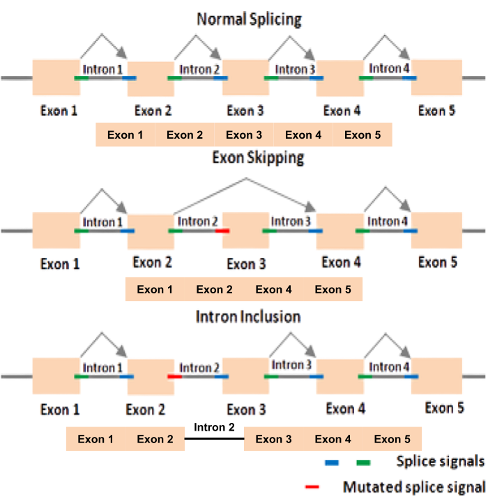

{:start="2"}
2. **Protein Processing** mutations result in functional protein being made, but it never reaches the cell surface where it is needed to function. There are 3 subcategories to this mutations:

*   **Insertion mutations** occur when base pairs are added to the DNA. If the number of added base pairs is not a multiple of three, it is also a **frameshift mutation**, in which all _codons_ (a sequence of 3 base pairs that codes for a single amino acid) after the inserted bases will be read incorrectly, so all the amino acids they code for will be wrong. If a frameshift mutation occurs early on in the protein-coding portion of the CFTR gene, the protein it produces will include many incorrect amino acids, so it will be very dysfunctional. If a frameshift mutation occurs towards the end of the protein-coding portion of the CFTR gene, however, only a few amino acids would be wrong, so the protein may still be functional. Thus, the severity of symptoms caused by this mutation varies.Regardless of how functional the produced CFTR protein would be, the cell characterizes it as dysfunctional and disposes of it in the _proteasome_ (an enzyme complex that degrades unneeded or damaged proteins). Thus, CFTR protein does not reach the cell surface where it is needed to function. 

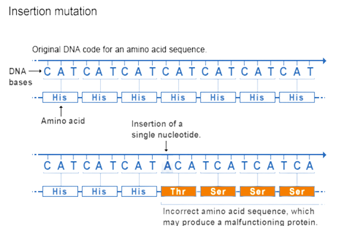

*   **Deletion mutations** are similar to insertion mutations since they can also cause frameshift mutations, but instead of adding bases, they remove base pairs from the DNA. One example of this is **F508del**, the most common CF-causing mutation. It is not a frameshift mutation, as the DNA is mutated to lack exactly three base pairs, so only one amino acid is missing from the protein. In patients with this mutation, the protein is produced, but it lacks an amino acid; the cell realizes that the protein is dysfunctional, so it disposes of it in the proteasome. _Trikafta_ is a drug that treats patients with this mutation by enabling the mutated proteins to fold correctly, thus preventing the cell from degrading them so the now functional proteins can travel to the cell surface and perform their job as ion channels.

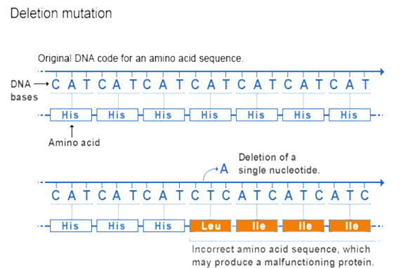

*   **Missense mutations** are a type of **substitution mutation**, in which a base pair in the DNA is changed so that when its mRNA is translated into a protein, there is an incorrect amino acid. When this mutation occurs in the CFTR gene, it generally causes defective processing of the protein so that it is unable to travel to the cell surface. 

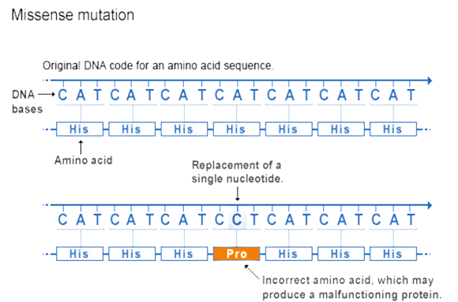

{:start="3"}
3. **Gating** mutations result in functional protein being made and transported to the cell surface, but the channel is permanently locked. The CFTR protein is an ion channel that the cell must open at times so that Cl⁻ can flow through; this mutation makes it difficult for the cell to open the channel, even though the CFTR protein itself is functional. One example of this is the **G551D** mutation, which can be treated by taking _Kalydeco_, a drug that forces the channel to open.

4. **Conduction** mutations result in the protein being made and transported to the cell surface, but it doesn’t function as well as it should. Patients with this mutation have some mutation in the protein-encoding region of the CFTR gene so that some amino acids are changed, thus the protein folds into a conformation shape that isn’t as effective as an ion channel. The inside of the channel may be obstructed so that Cl⁻ flows through slower; since the protein still functions to an extent, patients with this mutation have less severe symptoms. One example of this is the **R117H** mutation, which can be treated by taking modulators that change the shape of the CFTR protein to allow Cl⁻ to flow through it faster.

5. **Insufficient Protein** mutations result in less functional protein reaching the cell surface either because less is protein is produced, most of the protein produced is disposed of since it is dysfunctional, or functional protein on the surface degrades too quickly. This type of mutation is often caused by missense and splice mutations, described above. Since patients with this mutation have some functional protein, they experience less severe symptoms, which can be treated by taking _Kalydeco_ or _Symdeko_, which force the ion channels to stay open longer to compensate for there being less CFTR protein on the cell surface. 

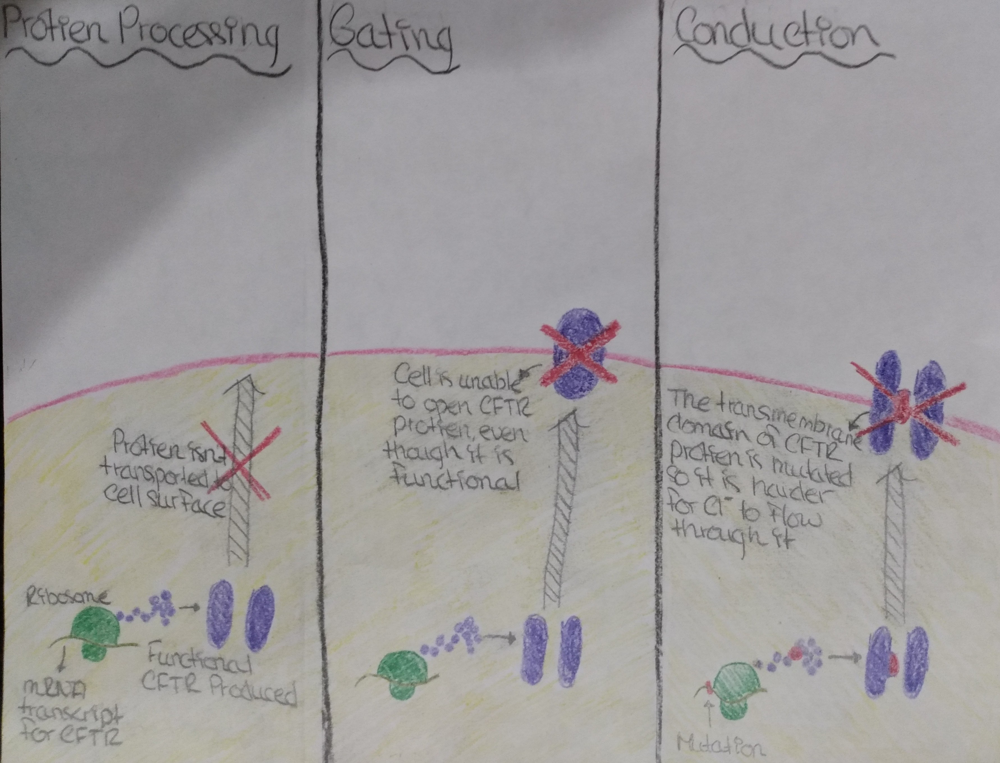

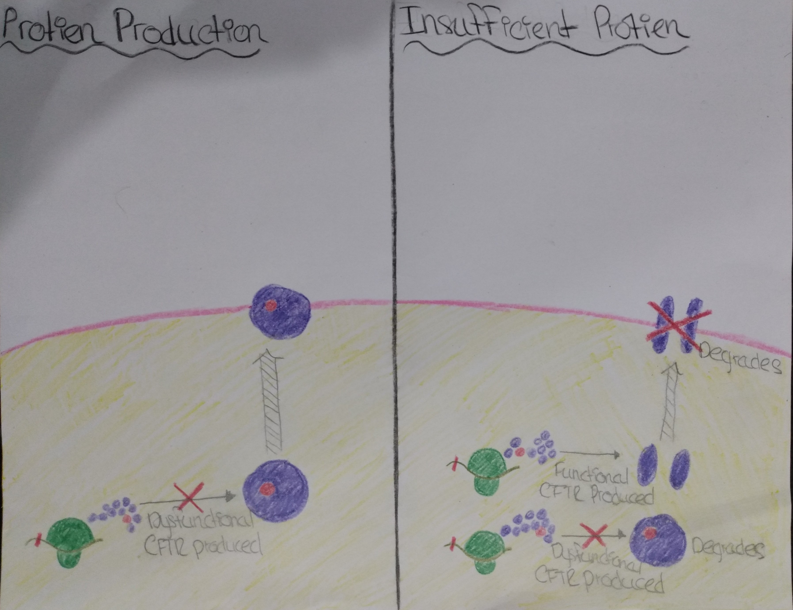
