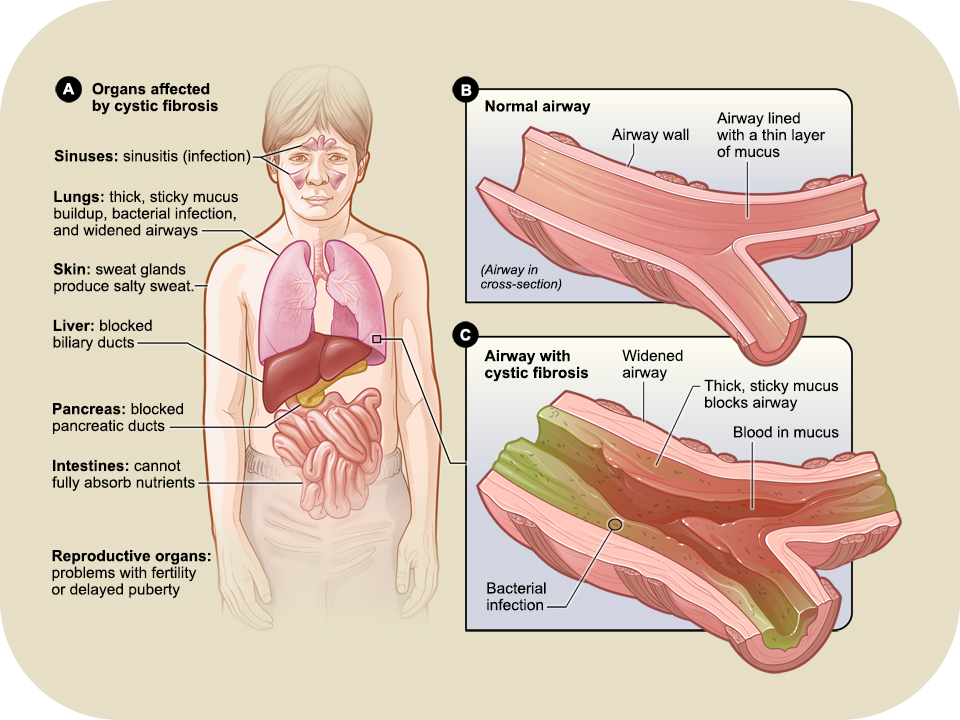
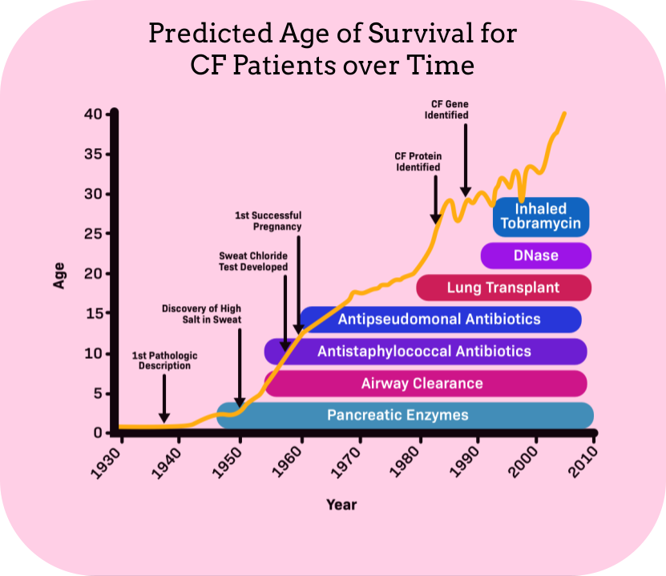

# Quality of Life

## Symptoms

1. Salty-tasting skin: _caused by salt imbalance due to inability of CFTR protein to effectively act as ion channel for Cl⁻_
2. Chronic coughing, sometimes with phlegm: _caused by build-up of mucus in airways_
3. Wheezing or shortness of breath: _caused by build-up of mucus in airways_
4. Frequent lung infections (pneumonia, bronchitis, etc): _caused by build-up of mucus in airways, which traps bacteria in the lungs_
5. Frequent sinus infections: _caused by build-up of mucus in airways, which traps bacteria in the sinuses_
6. Poor or stunted growth: _caused by inefficacy of digestive system to absorb nutrients from food_
7. Difficulty with bowel movements: _caused by inefficacy of digestive system_

_The symptoms of CF range throughout the body, however they are most concentrated in the respiratory and digestive systems._

## Body

CF affects the **respiratory system**, especially the _lungs_, because the mucus that accumulates on top of _epithelial cells_ (tissue that makes up skin and the linings of hollow organs) clogs the airway. This can make it hard for patients to breathe and lead to chronic coughing. This mucus also traps bacterias in the airways, which means CF patients are much more susceptible to lung and sinus infections, inflammation, and respiratory failures, whose effects are much more severe in patients than unaffected individuals. As such, constant sanitization is crucial for patients to prevent infections.

CF also affects the **digestive system** because the mucus buildup in the _pancreas_ prevents the release of digestive enzymes. Without these crucial enzymes, the body is unable to effectively absorb nutrients, which can lead to malnutrition, poor growth, and difficulty with bowel movements. 

## CFTR-Related Metabolic Syndrome

Some individuals have intermediate symptoms of CF, meaning they have **CFTR-related metabolic syndrome (CRMS)**, also known as _CF Screen Positive Inconclusive Diagnosis (CFSPID)_. Patients typically have mutations in the CFTR gene, but they are not severe enough to cause full-scale CF, only CRMS. Babies can be diagnosed with CRMS if they have high IRT levels in the NBS test, a sweat Cl⁻ value between 30 and 59 mmol/L in the sweat test, and mutations (not necessarily CF-causing) in their CFTR alleles. To confirm the diagnosis, the babies are checked to see if they meet the conditions of one of two CRMS cases:

1. 

*   The baby has a sweat Cl⁻ value less than 30 mmol/L
*   The baby has mutations in two of their CFTR alleles
*   At most one of their mutated alleles confers physical symptoms of CF

{:start="2"}
2. 

*   The baby has a sweat Cl⁻ value between 30 and 59 mmol/L
*   The baby has mutations in at most one of their CFTR alleles
*   At most one of their mutated alleles confers physical symptoms of CF

Babies with CRMS have an unclear future as they have intermediate symptoms of CF. They have an increased risk for problems of the airways, sinuses, intestines, pancreas, and reproductive system, and may later be diagnosed with full-scale CF. 

## Prognosis

Thanks to modern medical care, many patients can live full lives, with the average lifespan of CF patients reaching 47 years of age. This is a great progress from the 1950s, when most patients died in childhood. Despite the great various treatments that enable patients to live full lives, there is still no cure for CF. 

_The predicted age of survival for CF patients has increased rapidly over time thanks to many advances in modern medicine._
