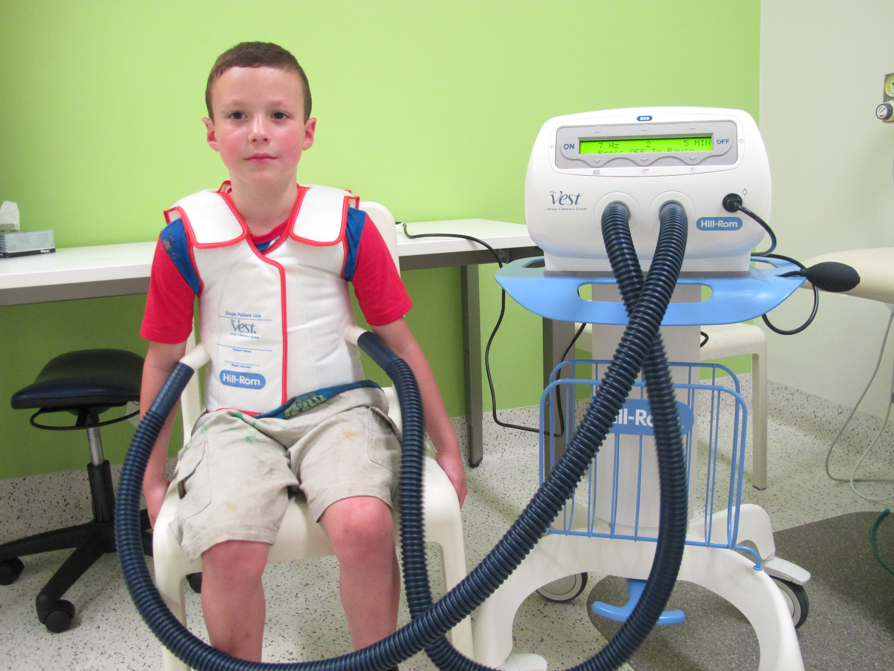
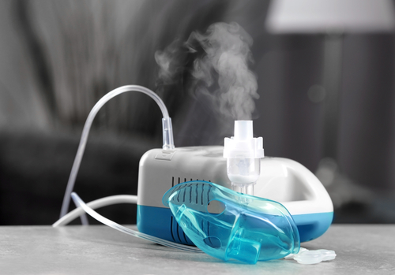
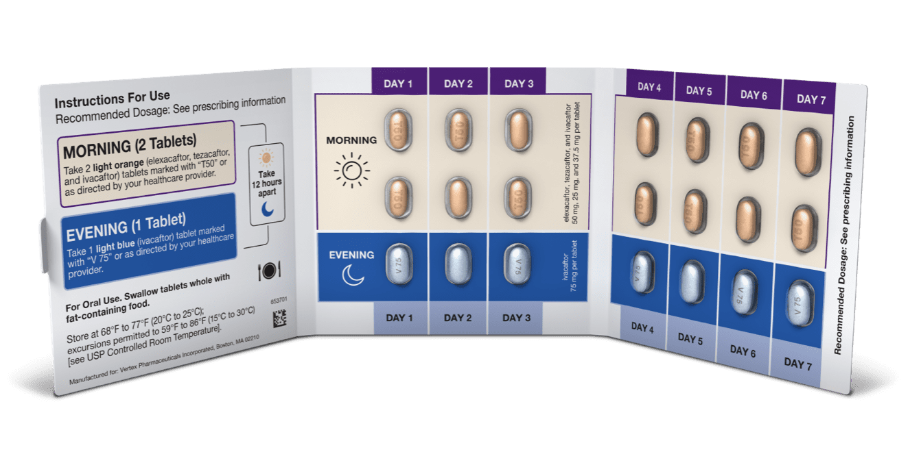
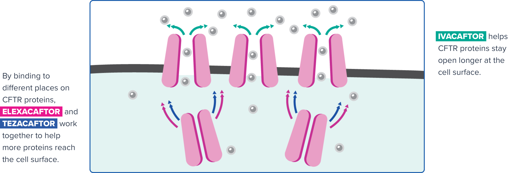

# Treatments

Because each patient has different mutations that affect how well the CFTR protein works, if at all, they have symptoms of varying degrees of severity, thus they require unique treatment plans. Erica Rice, mother to a daughter with CF, explained, “[T]here is no right answer to pretty much everything. Different people are affected differently even by the same genetic makeup. There’s different severities. . . so you don’t know how it’s [CF] going to turn out.” Most plans include a combination of the following treatments: 

1. **Airway Clearance Techniques (ACTs)**: Patients use various methods to loosen and remove the mucus buildup in their lungs to attenuate the effects of CF. This includes _percussion vest therapy_, in which the patient wears a vibrating vest for 30 minutes to 1 hour a day to help clear their airways. 

{:start="2"}
2. **Inhaled medicines**: Patients inhale liquid medications that include antibiotics to fight lung infections and therapies to clear their airways as an aerosol through a _nebulizer_.

{:start="3"}
3. **Sanitization**: Patients must be very careful about sanitization because they are especially vulnerable to infections. As Mrs. Rice explained, “It’s just this constant awareness of what you’re exposed to and how you’re preventing germs from entering the body.” In a personal interview, Mrs. Rice described some of the sanitization measures that her family implements to keep their daughter safe:

> “She has about 50 toothbrushes. . . She uses it once and it goes into the dishwasher and gets boiled and UV sanitized."

> “Anything that went into her mouth, it would get boiled and UV sterilized.”

> “[T]owels get used once and then washed.”

{:start="4"}
4. **Pancreatic enzyme supplement capsules**: Patients take pills to supplement their lack of pancreatic enzymes with every meal, thus improving the absorption of nutrients.
enzyme_pills.jpg

5. **Multivitamins**: Patients take personalized multivitamins to provide nutrients that may otherwise not be absorbed due to their lack of pancreatic enzymes.

6. **Fitness plan**: Patients work with their doctors to create a personalized fitness plan to help improve energy, lung function, and overall health. 

7. **CFTR modulators**: Patients take medications that target the defect in their specific CFTR protein. [**Trikafta**](https://www.trikafta.com/){:target="_blank"} is one popular modulator, recently FDA approved in 2019, composed of three different modulating medications: _Elexacaftor_, _Tezacaftor_, and _Ivacaftor_. For many patients, this combination of modulators has proven especially effective in attacking their CF at the source. 

* Some patients have such rare mutations that there are no modulators formulated specifically to treat their mutation. Instead, using **theratyping**, researchers apply modulators to _cell lines_ (population of human cells kept in a petri dish for research purposes) engineered to have specific mutations to identify which modulators work on which mutations. This is especially useful for patients with rare mutations because it allows researchers to determine which pre-existing modulators are also effective in treating rare mutations. 
